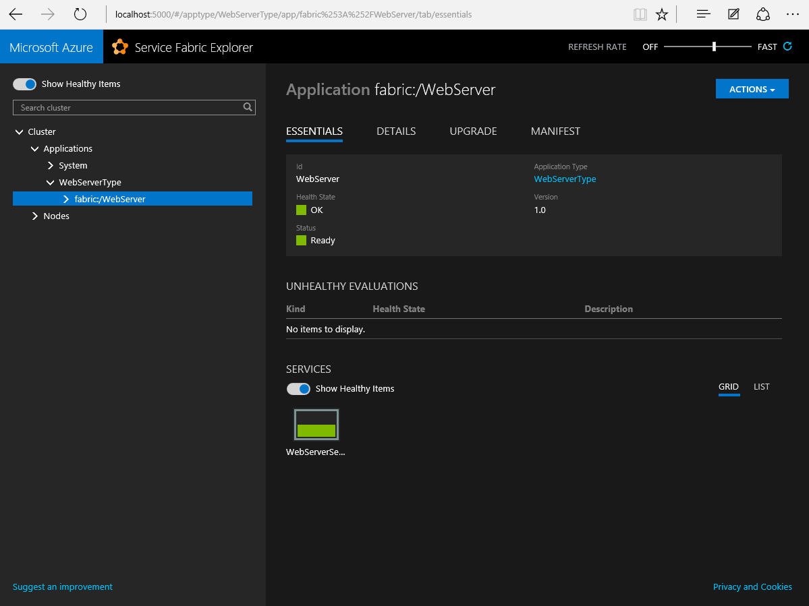

# Package and deploy a guest executable

This sample shows how to take an arbitrary EXE that is not built on Actors, Services, or any Service Fabric APIs and deploy it to a Service Fabric cluster. The EXE it uses is SimpleWebServer.exe, which is a simple web server that listens on port 8080 and returns the machine name based on a query string parameter. You can launch the application by double clicking on SimpleWebServer.exe (you may need to start with elevated privileges). Type http://localhost:8080/?cmd=instance in the address bar of your browser. The image below shows the running application SimpleWebServer.exe


## Content of the sample

- SimpleWebServer.exe: The sample application
- Service Fabric Package: This folder contains a pre-created Service Fabric application package for the SimpleWebServer.exe.
- Scripts: Contains a PowerShell script to deploy the Service Fabric application package to the local and remote Service Fabric cluster

## How to use the sample

### Just run it
Pull down the sample on your local machine and go to the scripts folder. Execute the PowerShell script for either your local development cluster (make sure it is running) or a Service Fabric cluster in Azure. You can check the status of the application running in Service Fabric by using the Service Fabric Explorer as shown below.




### Package the application and run it
The easiest way to create an application package is using the Service Fabric packaging tool. The tool is currently in preview and is available for download [here](http://aka.ms/servicefabricpacktool).

```
ServiceFabricAppPackageUtil.exe /source:[directory of SimpleWebServer.exe] /target:[directory that will contain the package] /appname:WebServer /exe:SimpleWebServer.exe
```
Next you need to define an endpoint on port 8080. To do this update the ServiceManifest.xml EndPoint element as shown below.

```xml
<Resources>
    <Endpoints>
     <Endpoint Name="WebServerTypeEndpoint" Protocol="http" Port="8080" Type="Input" />
    </Endpoints>
</Resources>
```

Modify the PowerShell script to point to your new Service Fabric application package folder and deploy it the package.

## Learn more

To learn more about Service Fabric, check out the [platform documentation](http://aka.ms/servicefabricdocs) on azure.com.
